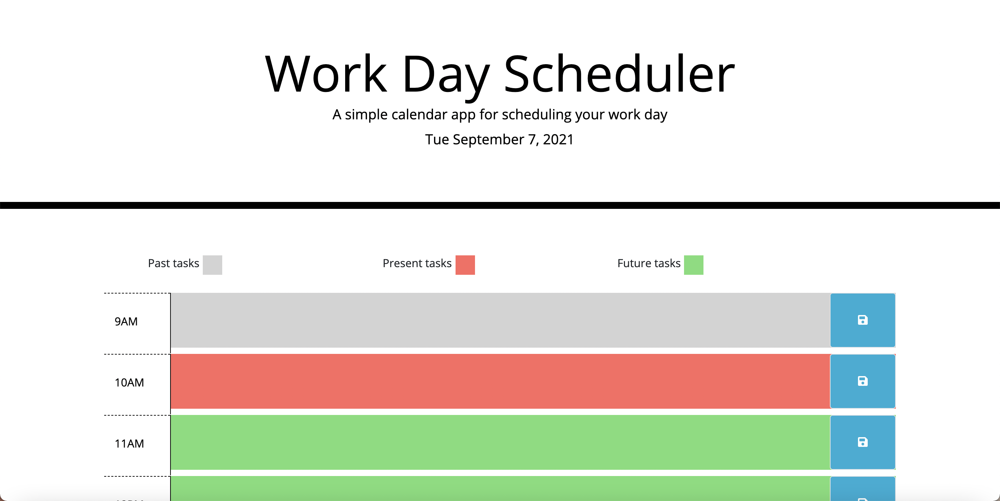
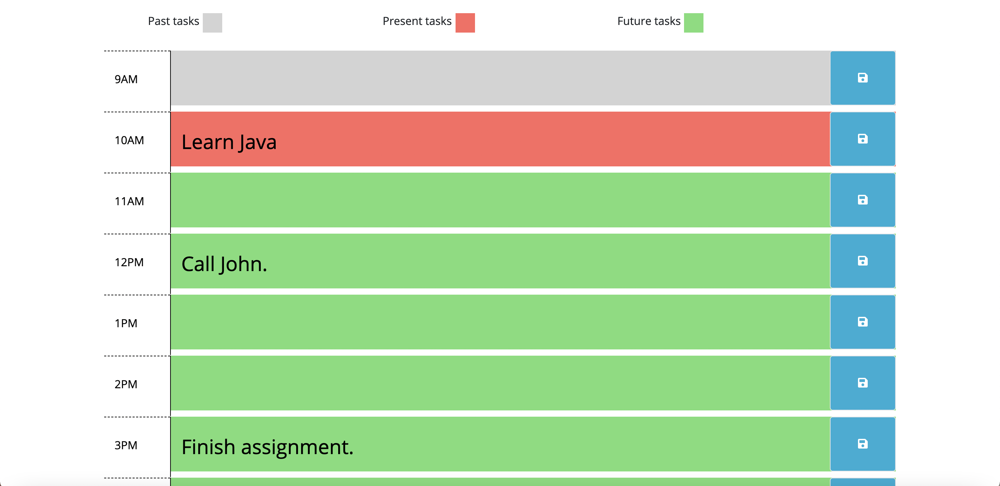

# Work Day Scheduler Starter Code
This page cosist of a daily scheduled task, created around business hours. each hour slot stores a task for a specific hour in the local storage. Also each is hour slot is color coded, this function  provides the user a visual queue of the past, present and future tasks.

This page also features a few interesting libraries such as:

* **Jquery**
* **Moment.js**
* **Bootstrap 4**

